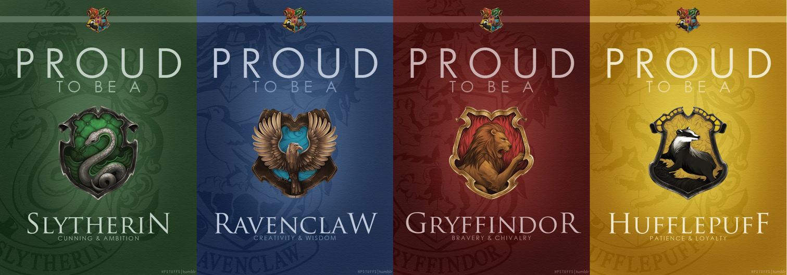

# Sorting Hat Project

In this project, I created a neuronal network for image classification (multiclass). This NN selects a Hogwarts house for you (Gryffindor, Hufflepuff, Ravenclaw or Slytherin).

If you want to have an overview, you can read my PDF (in this repository) when I explain step by step what I did.

## How to use

If you want to use my model, you can execute "`RNN_houses.ipynb`" and save the model in your computer. Then, you have to execute the file `"guiapp.py"`in your terminal and upload the image you want to classify.

## Libraries

The libraries I used in this project were:

- `numpy`
- `opencv`
- `pandas`
- `pytorch`
- `torchvision`
- `tkinter`
- `tensorflow`
- `keras`
- `splitfolders`
- `glob`
- `os`
- `requests`

## Step by step

### Collecting data

First, I got my data using web scraping and manual searching (because of some file types like lazyload then I couldn't scrape).

### Preprocessing data

I located only faces in my pics and processed images (64x64 sized and black&white). In addition I separated images by house (my 4 classes)

### Cleaning data

I had to delete : hair, objects, clothes, wrongly cut faces, duplicated faces, etc.

### Splitting data

I separated houses (with their faces) in 3 samples: train, test and validation.

###  Choosing model

I used a few models and finally, I chose a `"Residual Neural Network"`.

###  Training model

I train and validate my model with my image folders.

### Testing model

I used my model with my split "test" to get metrics about my neural network.
###  Creating GUI
 Finally, I used intertk to make a graphical interface when users can upload an image and guess their house.

## Issues

My principal problem was I could not get much data so the accuracy of my model is not very good. In the future I would like to increase my datset to improve accuracy as well as improve the graphical interface.

